# Reinforced Machine Training Environment (🚧WIP🚧)

This is the training environment for Reinforced Machine, a twin-stick shooter action game. 
Choose your favorite mech, each with their own unique skills. Unleash powerful attacks with the help 
of your AI-assisted weapons to aid you in your battle against legions of cyborg creatures.

The trained AI Agent model is used to customize the weapon's behavior in the game.
Players select a weapon, then choose their preferred AI Agent model from a list of pre-trained models,
community trained models shared publicy, or their own custom trained models.

<p align="center">
  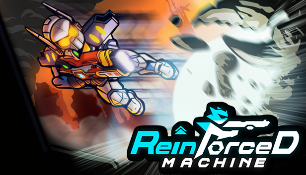
</p>

<p align="center">
 <a href="https://store.steampowered.com/app/2440860/Reinforced_Machine/">
  
 </a>
</p>

# Getting Started
There are two ways to train and run the Reinforced Machine training environment.

1. **(Recommended)** In Google Colab where all the needed dependencies will be installed and pull the
   latest Reinforced Machine Training Linux build.
   - https://colab.research.google.com/drive/1Y9a7H1_fKiyBObvVmjztJ9WC_Id7qhb1

2. Train it locally. Here you need to setup Unity ML Agents `Release 21` and install
   Pytorch along with all its dependencies.

If you wish to train locally, follow the steps on how to install Unity ML-Agents in your local machine on this page.

[Installing Unity MLAgents](docs/Install_Unity_MLAgents_Local)

The next section is a guide on how to train the AI Agent. This applies to both training environments running in
Google colab or in your local machine.

# Reinforced Machine Training Environment

## Download the training environment
TODO: Create builds for Windows and Linux

## Start Training using Unity ML-Agents

Run this command to train with the Reinforced Machine executable build.

```
mlagents-learn ./ppo/RM_PPO_EnergyGun.yaml --env="./builds/RM_Game_Training_Only" --run-id=RM_PPO_EnergyGun_01 --time-scale=1
```

This sets the `time-scale` to `1`. Remove it to make the AI Agent train faster.

<p align="center">
  
</p>

## Run in Inference Mode

After training the AI Agent, use the resulting ONNX model to run the build in Inference Mode.

TODO: Pass env variable with full file path of the ONNX model

## Using the Trained AI Agent Model in the Actual Game

Your trained AI Agent model can be used in the game. More details to follow near the release of the game.

<p align="center">
  
</p>

# Weapon AI Agents

Each weapon has its own implementation of the AI Agent. This means it has its own **action space** and some weapons have
custom **observations** added to feed to the neural network.

<div align="center">
  
| Weapon                                                                | Behavior Name  | Weapon ID | Training Document                                                    |
|-----------------------------------------------------------------------|----------------|-----------|----------------------------------------------------------------------|
| 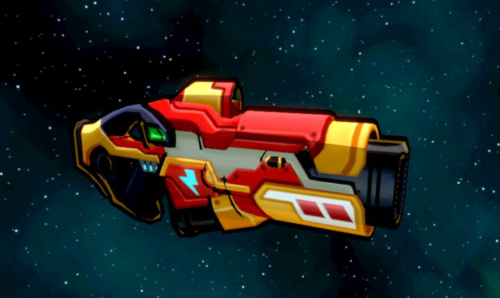      | EnergyGun      | 0         | [Energy Gun Training Document](docs/Weapon01_EnergyGun.md)           |
| 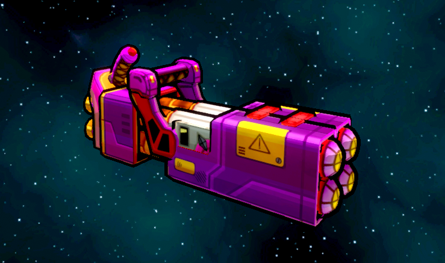 | RocketLauncher | 1         | [Rocket Launcher Training Document](docs/Weapon02_RocketLauncher.md) |
| 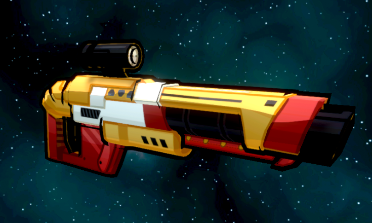       | LaserGun       | 2         | [Laser Gun Training Document](docs/Weapon03_LaserGun.md)             |
| 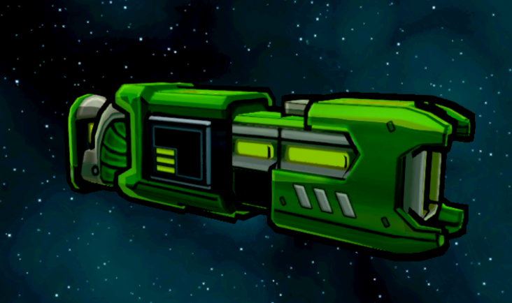      | PortalGun      | 3         | [Portal Gun Training Document](docs/Weapon04_PortalGun.md)           |
| 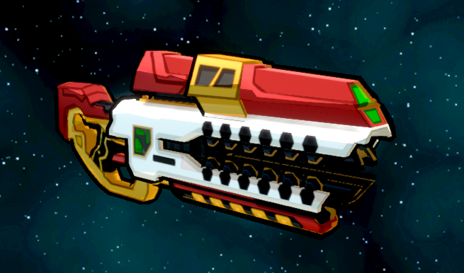        | RailGun        | 4         | [Rail Gun Training Document](docs/Weapon05_RailGun.md)               |
| 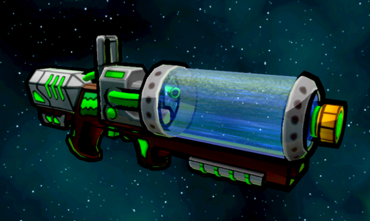        | AcidGun        | 5         | [Acid Gun Training Document](docs/Weapon06_AcidGun.md)               |
| 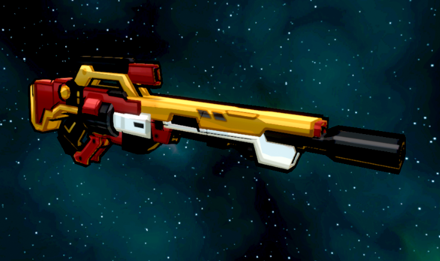    | SniperRifle    | 6         | [SniperRifle Training Document](docs/Weapon07_SniperRifle.md)        |
| 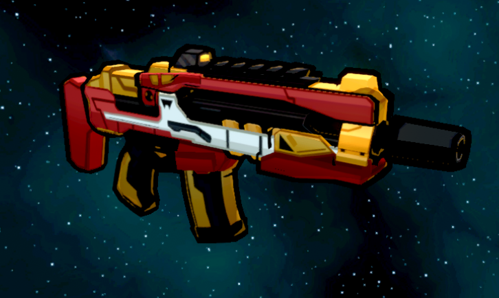   | AssaultRifle   | 7         | [AssaultRifle Training Document](docs/Weapon08_AssaultRifle.md)      |
| 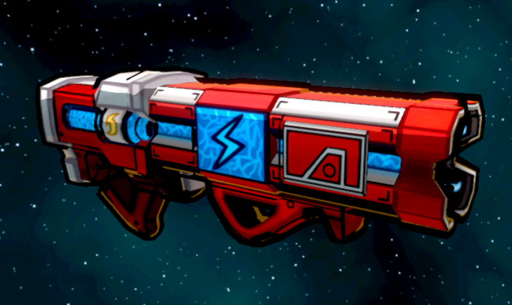    | ElectricGun    | 8         | [Electric Gun Training Document](docs/Weapon09_ElectricGun.md)       |
| 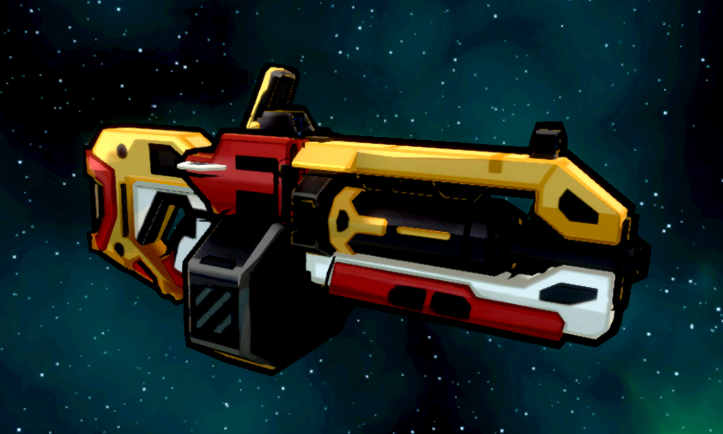     | MachineGun     | 9         | [Machine Gun Training Document](docs/Weapon10_MachineGun.md)         |
| 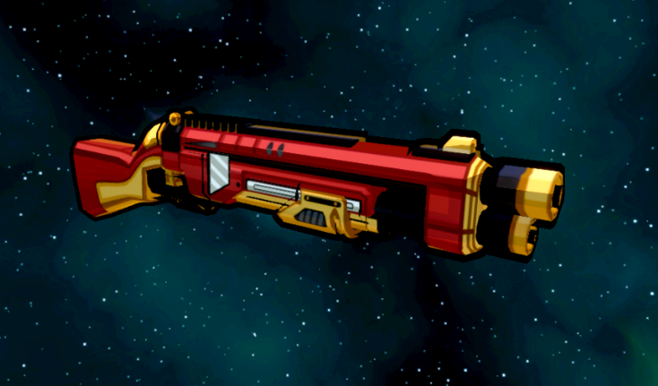        | ShotGun        | 10        | [Shot Gun Training Document](docs/Weapon11_ShotGun.md)               |

</div>

