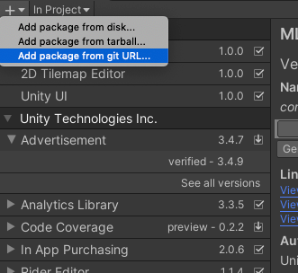

# Reinforced Machine Training Environment (🚧WIP🚧)

This is the training environment for Reinforced Machine, a twin-stick shooter action game. 
Choose your favorite mech, each with their own unique skills. Unleash powerful attacks with the help 
of your AI-assisted weapons to aid you in your battle against legions of cyborg creatures.

The trained AI Agent model is used to customize the weapon's behavior in the game.
Players selects a weapon, then choose their preferred AI Agent model from a list of pre-trained models,
community trained models shared publicy, or their own custom trained models.

<p align="center">
  
</p>

<p align="center">
 <a href="https://store.steampowered.com/app/2440860/Reinforced_Machine/">
  
 </a>
</p>

# Getting Started
There are two ways to train and run the Reinforced Machine training environment.

1. **(Recommended)** In Google Colab where all the needed dependencies will be installed and pull the
latest Reinforced Machine Training Linux build.
   - https://colab.research.google.com/drive/1Y9a7H1_fKiyBObvVmjztJ9WC_Id7qhb1

2. Train it locally. Here you need to setup Unity ML Agents `Release 21` and install
Pytorch along with all its dependencies.

#  Setting up Local Training Dependencies

## Install miniconda and Python
Install `miniconda` by following the steps in https://docs.anaconda.com/free/miniconda/

Once installed, create and activate a conda environment.

```
# create conda environment and install python 3.10.12
conda create -n ml-agents-rel-21_python-3.10.12 python=3.10.12

# activate created environment
conda activate ml-agents-rel-21_python-3.10.12
```

Install Python 3.10.x

```
# Upgrade pip
python -m pip install --upgrade pip

# Confirm versions
python --version
pip --version
pip3 --version
```

## Install Unity ML Agent


Several ways to install ML-Agents. Cloning the repository is the recommended way.
https://unity-technologies.github.io/ml-agents/Installation/#clone-the-ml-agents-toolkit-repository-recommended 

Clone `ml-agents` on branch `release_21`.
```
git clone --branch release_21 https://github.com/Unity-Technologies/ml-agents.git ml-agents-release_21
```

There is a bug in `release_21` branch on `Numpy`.

```
setup.py:63: RuntimeWarning: NumPy 1.21.2 may not yet support Python 3.10.”
```

This is fixed in the `develop` branch, but it's better to use the `release` branch. [Issue 6008](https://github.com/Unity-Technologies/ml-agents/issues/6008) 

A workaround to this issue is updating `"numpy==1.21.2"` to `"numpy==1.23.3"` in the file 
`/ml-agents-envs/setup.py`

To install the `mlagents` Python package run these commands.
Also see [Installing ML-Agents]([https://github.com/Unity-Technologies/ml-agents/issues/6008](https://unity-technologies.github.io/ml-agents/Installation/#installing-mlagents)) 

```
# go to the repo root directory
cd /ml-agents-release_21

# install dependencies
python -m pip install ./ml-agents-envs
python -m pip install ./ml-agents

# then test
mlagents-learn --help
```

This will install `mlagents` from the cloned repository, not from the PyPi repository.
If you installed this correctly, you should be able to run `mlagents-learn --help`, after which 
you will see the command line parameters you can use with `mlagents-learn`.

## Install ML-Agents Unity Package in Unity Package Manager

```
NOTE: Steps copied from https://github.com/Unity-Technologies/ml-agents/blob/develop/com.unity.ml-agents/Documentation~/com.unity.ml-agents.md  
This is better for sharing the repository as there is no dependency on local ml-agent repository.
Note this is a Unity package, and different from the ML-Agents learn from the previous section
```

In `Unity 2019.4` or later, open the `Package Manager`, hit the `"+"` button, and select `"Add package from git URL"`.

<p align="center">
  
</p>

In the dialog that appears, enter the following

```
git+https://github.com/Unity-Technologies/ml-agents.git?path=com.unity.ml-agents#release_21

(...AND OPTIONAL extensions)
git+https://github.com/Unity-Technologies/ml-agents.git?path=com.unity.ml-agents.extensions#release_21
```

You can also edit your project's `manifest.json` directly and add the following line to the `dependencies` section:

```
"com.unity.ml-agents": "git+https://github.com/Unity-Technologies/ml-agents.git?path=com.unity.ml-agents#release_21",
```

## Setting up Pytorch (Deep Learning Framework)

Starting from this point, including the next installation steps, make sure you are using 
the created conda environment in the earlier steps before running the next command.

Run `conda env list` and the selected environment must be `ml-agents-rel-21_python-3.10`

Run this command to install `Pytorch v1.13.1`.

```
pip3 install torch~=1.13.1 -f https://download.pytorch.org/whl/torch_stable.html
```

# Reinforced Machine Training Environment

## Download the training environment
TODO: Create builds for Windows and Linux

## Start Training using Unity ML-Agents

Run this command to train with the Reinforced Machine executable build.

```
mlagents-learn ./ppo/RM_PPO_EnergyGun.yaml --env="./builds/RM_Game_Training_Only" --run-id=RM_PPO_EnergyGun_01 --time-scale=1
```

This sets the `time-scale` to `1`. Remove it to make the AI Agent train faster.

<p align="center">
  
</p>

## Run in Inference Mode

After training the AI Agent, use the resulting ONNX model to run the build in Inference Mode.

TODO: Pass env variable with full file path of the ONNX model

## Using the Trained AI Agent Model in the Actual Game

On game release of Reinforced Machine, the trained AI Agent model can be used to customize the weapon's behavior.
The game will allow players to select a weapon, then select their preferred AI Agent model from a list of pre-trained models,
community trained models shared publicly, or their own custom trained models.

<p align="center">
  
</p>

# Weapon AI Agents

Each weapon has its own implementation of the AI Agent. This means it has its own **action space** and some weapons have
custom **observations** added to feed to the neural network.

<div align="center">
| Weapon                                                           | Behavior Name | Weapon ID | Training Document                                          |
|------------------------------------------------------------------|---------------|-----------|------------------------------------------------------------|
|  | EnergyGun     | 0         | [Energy Gun Training Document](docs/Weapon01_EnergyGun.md) |
</div>

